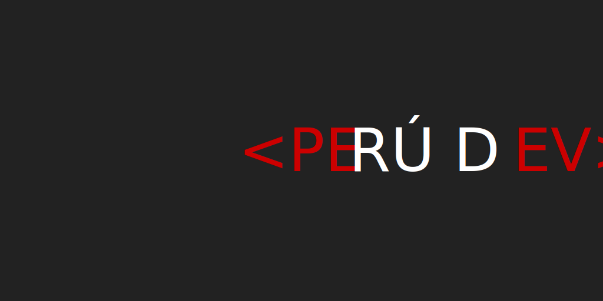

# Perú Dev

Somos una **comunidad** que quiere ser el punto de encuentro entre **comunidades
técnicas** en Perú.

Perú Dev es una iniciativa dinámica de entusiastas, que busca acercar, ayudar y
fomentar a diferentes (y diversas) comunidades de desarrolladorxs alrededor de
ciertos **[principios](#principios) y [valores](#valores) compartidos** que
consideramos son el pilar fundamental.

Síguenos en [Twitter](https://twitter.com/peru_dev) y/o súmate a la conversación
en [Discord](https://discord.gg/8UhsHq3) para enterarte de nuestros eventos e
iniciativas.

## Dónde encontrarnos

* [Página web](https://peru-dev.org) :construction:
* [Discord](https://discord.gg/8UhsHq3)
* [GitHub](https://github.com/peru-dev)
* [Twitter](https://twitter.com/peru_dev)
* [Calendario](https://calendar.google.com/calendar/embed?src=mvr7nl37090t60ueokhou1gcfc%40group.calendar.google.com&ctz=America%2FLima)

## Valores

Creemos en los siguientes _valores_ y queremos fomentarlos:

* Compartir
* Inclusión
* Respeto
* Tolerancia
* Integridad
* Comprensión
* Humildad
* Solidaridad
* Empatía
* Aprendizaje
* Honestidad
* Responsabilidad

## Principios

Las comunidades que participan de esta iniciativa ...

* Se adhieren a un [código de conducta](https://github.com/peru-dev/codigo-de-conducta).
* No son de nadie. No tienen dueñxs.
* Fomentan el aprendizaje.
* No deben tener como objetivo principal la promoción de productos o servicios.
* No tienen ánimo de lucro.
* Son abiertas e inclusivas.
* Fomentan, dan soporte y apoyan a speakers locales.
* Buscan y celebran excelencia técnica.
* Invitan a gente sin experiencia a participar.
* Difunden y fomentan el libre acceso al conocimiento, a la tecnología,
  metodologías de trabajo y sus buenas prácticas.
* Fomentan la participación de los asistentes, con feedback, propuestas, ideas y
  sugerencias.
* Mantienen la privacidad de la información recolectada, a excepción de la
  brindada a los sponsors/venue, para la asistencia y seguridad de los eventos.

## Objetivos

* Promover ecosistema tecnológico
* Instar espacios de aprendizaje
* Promover comunidades
* Promover conferencias y eventos
* Promover speakers
* Promover difusión de conocimiento
* Promover cultura de colaboración, aprendizaje y compartir
* Coordinar esfuerzos entre comunidades
* Compartir recursos entre comunidades
* Dar visibilidad a comunidades en provincias (Lima no es el Perú)

## Rituales

* Hangouts cada dos semanas (martes 7pm). Se anuncian por [Discord](https://discord.gg/8UhsHq3).
* Anuncios y conversación general en [Discord](https://discord.gg/8UhsHq3)
* Ideas, propuestas, sugerencias, ... como [issues](https://github.com/peru-dev/peru-dev.org/issues/new) o PRs.
* Compartir fechas (o fechas tentativas) de eventos en el
  [calendario compartido](https://calendar.google.com/calendar/embed?src=mvr7nl37090t60ueokhou1gcfc%40group.calendar.google.com&ctz=America%2FLima)
  para minimizar _date collision_ y promover colaboración.
* Conferencia anual :construction:
* Anuncios de eventos/calendario via redes sociales :construction:
* Promover los call for papers de otras comunidades :bulb:
* Ofrecer _dry runs_ a speakers :bulb:
* Desconferencias :bulb:
* Hackatones :bulb:

## Comunidades

Este listado no pretende ser una lista _completa_ de comunidades en Perú, si no
simplemente la lista de las comunidades que participan directa o indirectamente
en la iniciativa de **Perú Dev**. Una manera de públicamente mostrar apoyo a
esta iniciativa, así como confirmar que se alinean a los [valores](#valores) y
[principios](#principios) compartidos.

| Comunidad | Organizadorxs |
|-----------|---------------|
| [LimaJS](https://limajs.org) | @lupomontero, @wixo, @Xpktro, @lizzie136 |
| [Mozilla Perú](http://www.mozilla.pe/) | @ccarruitero, @AngelFQC, @lupomontero |
| [Lima Frontend](https://limafrontend.org/) | @techfano, @pynef, @pilmee |
| [Vuejs @ Lima](https://vuejslima.com/) | @JoshDev1205, @talueses |
| [Vue Vixens PE](https://twitter.com/vuevixensPE) | @MaiaRojas, @developerVilchez, @RuthSalvador |
| [Data Science Research Perú](https://datascience.pe) | @Cuica20 |

***

## Otros recursos

* [Netiqueta](https://es.wikipedia.org/wiki/Netiqueta)
* [Changelogs](https://keepachangelog.com/en/1.0.0/)
